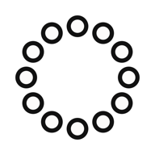
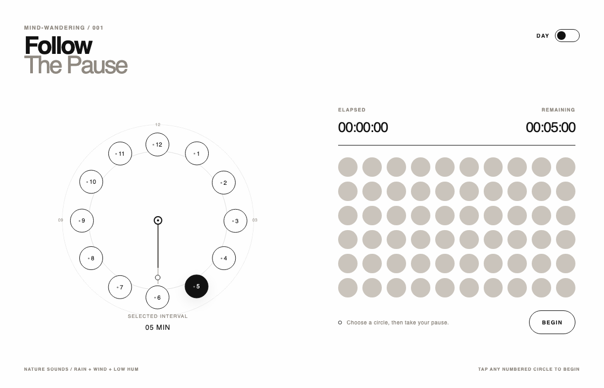

<div align="center">
  
  <h1>Mind-Wandering Clock</h1>
  <p>A quiet timer for letting attention loosen.</p>
  <p>
    <a href="https://github.com/waitingkawa/Mind-Wandering-Clock/releases/latest"><strong>Download for macOS</strong></a>
    &nbsp;&nbsp;·&nbsp;&nbsp;
    <a href="https://waitingkawa.github.io/Mind-Wandering-Clock/"><strong>Open the web app</strong></a>
  </p>
  <sub>macOS · iPad and iPhone · Browser</sub>
</div>

<br>



Pick a circle and step away for a minute or twelve. The clock counts down without demanding attention: a hand moves, sixty dots fill, and rain, wind, and a low hum sit quietly underneath. When the pause is over, a soft chime brings you back.

No account. No tracking. Timer state and audio stay on your device.

## What is inside

- Twelve one-tap intervals arranged around a clock face
- A 60-dot field that makes elapsed time visible at a glance
- Day and Night modes with a remembered preference
- Synthesized rain, wind, low hum, and a gentle completion chime
- A draggable macOS window that can stay near your work
- An installable PWA with offline support

## Download

The latest macOS build is on [GitHub Releases](https://github.com/waitingkawa/Mind-Wandering-Clock/releases/latest).

- Apple Silicon Macs use the `arm64` build.
- Intel Macs use the `x64` build.
- The DMG is the standard installer. The ZIP contains the app directly.

The current builds are unsigned. If macOS blocks the first launch, Control-click the app, choose **Open**, then confirm once.

On iPad or iPhone, open the [web app](https://waitingkawa.github.io/Mind-Wandering-Clock/) in Safari, tap **Share**, then choose **Add to Home Screen**.

## Run it locally

Mind-Wandering Clock requires Node.js 22 or newer.

```bash
git clone https://github.com/waitingkawa/Mind-Wandering-Clock.git
cd Mind-Wandering-Clock
npm ci
npm run dev
```

Open the desktop version:

```bash
npm run desktop:start
```

Check the code and create a production build:

```bash
npm run check
```

Create a DMG and ZIP for the current Mac architecture:

```bash
npm run desktop:dist
```

Build output is written to `release/`.

## Work with a coding agent

[`AGENT_PROMPT.md`](AGENT_PROMPT.md) is a copy-ready brief for Codex, Claude Code, Cursor, and similar tools. Add the task and acceptance criteria at the bottom. The rest explains the clock's design, behavior, and release process.

## Publish a release

Keep the version in `package.json` and the Git tag in sync:

```bash
npm version patch
git push origin main --follow-tags
```

A tag such as `v1.1.1` starts the release workflow and attaches Apple Silicon and Intel downloads. Use `minor` or `major` when the change calls for it.

The web app is published from `main` with GitHub Pages. In the repository settings, choose **Pages → Source → GitHub Actions** once.

## Contributing

Small, focused pull requests are welcome. Include a screenshot with visual changes and a short test note with behavior changes. Please open an issue before starting a large redesign so the direction can be discussed first.

## License

[MIT](LICENSE)
